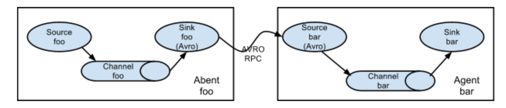

## demo1: netcat-file.properties

从网络端口44444收集数据，并输出数据到本地文件/home/flume/logs/

**source端数据模拟：**

  `$ telnet localhost 44444`
   输入一些数据

**sink端查看数据接收情况：**
到文件目录/home/flume查看有文件生成，一次telnet生成了一个

```bash
[root@host-10-1-236-60 logs]# ls -al
total 8
drwxr-x--- 2 flume flume 116 Mar 23 16:38 .
drwx------ 3 flume flume  70 Mar 23 16:24 ..
-rw-rw-r-- 1 flume flume  19 Mar 23 16:37 1584952236952-1
-rw-rw-r-- 1 flume flume   0 Mar 23 16:37 1584952236952-2
-rw-rw-r-- 1 flume flume  11 Mar 23 16:37 1584952236952-3
-rw-rw-r-- 1 flume flume   0 Mar 23 16:37 1584952236952-4
-rw-rw-r-- 1 flume flume   0 Mar 23 16:38 1584952236952-5

```

如果报错：说明你指定的输出目录没有权限,查一下读写权限和属主
```java
org.apache.flume.EventDeliveryException: Failed to open file /home/flume/logs/1584952236952-1 while delivering event
	at org.apache.flume.sink.RollingFileSink.process(RollingFileSink.java:185)
	at org.apache.flume.sink.DefaultSinkProcessor.process(DefaultSinkProcessor.java:67)
	at org.apache.flume.SinkRunner$PollingRunner.run(SinkRunner.java:145)
	at java.lang.Thread.run(Thread.java:745)
Caused by: java.io.FileNotFoundException: /home/flume/logs/1584952236952-1 (Permission denied)
	at java.io.FileOutputStream.open0(Native Method)
	at java.io.FileOutputStream.open(FileOutputStream.java:270)
	at java.io.FileOutputStream.<init>(FileOutputStream.java:213)
	at java.io.FileOutputStream.<init>(FileOutputStream.java:162)
	at org.apache.flume.sink.RollingFileSink.process(RollingFileSink.java:176)
	... 3 more

```


## demo2: tail-hdfs.properties

通过exec 执行tail -F /home/flume/logs/test.log 收集文件内容到hdfs中

**source端数据模拟：**

`echo "hello world" >> /home/flume/logs/test.log`

**sink端查看数据接收情况：**

```bash
$ hdfs dfs -ls /data/flume-event/20-03-23/17-06
Found 23 items
-rw-r--r--   3 flume hdfs         12 2020-03-23 17:06 /data/flume-event/20-03-23/17-06/test_.1584954387344
-rw-r--r--   3 flume hdfs         12 2020-03-23 17:06 /data/flume-event/20-03-23/17-06/test_.1584954387345
-rw-r--r--   3 flume hdfs         12 2020-03-23 17:06 /data/flume-event/20-03-23/17-06/test_.1584954387346
$ hdfs dfs -cat /data/flume-event/20-03-23/17-06/test_.1584954387344
hello world
```

 注意：保证flume agent执行用户有读取文件和访问hdfs权限，如果没有要添加


## demo3 tail-avro-hdfs.properties

multi-agent flow




Source1: exec tail -F /home/flume/logs/test.log

Sink1:Avro

Source2: Avro

Sink2: hdfs://host-10-1-236-60:8020/data/flume-event/%y-%m-%d/%H-%M

**source端数据模拟：**

```bash
$ echo "hello hello hello" >> /home/flume/logs/test.log
$ echo "hello hello hello" >> /home/flume/logs/test.log
$ echo "hello hello hello" >> /home/flume/logs/test.log
```

**sink端查看数据接收情况：**

```bash
$ hdfs dfs -ls /data/flume-event/20-03-23/17-53
Found 1 items
-rw-r--r--   3 flume hdfs        117 2020-03-23 17:53 /data/flume-event/20-03-23/17-53/data_.1584957218549
$ hdfs dfs -cat /data/flume-event/20-03-23/17-53/data_.1584957218549
[root@host-10-1-236-60 logs]# hdfs dfs -cat /data/flume-event/20-03-23/17-53/data_.1584957218549
hello world
hello world
hello world
hello world
hell
hell
hell
hello hello hello
hello hello hello
hello hello hello
# 可以看到这次echo的hello hello hello之前的数据也写进去了
```

